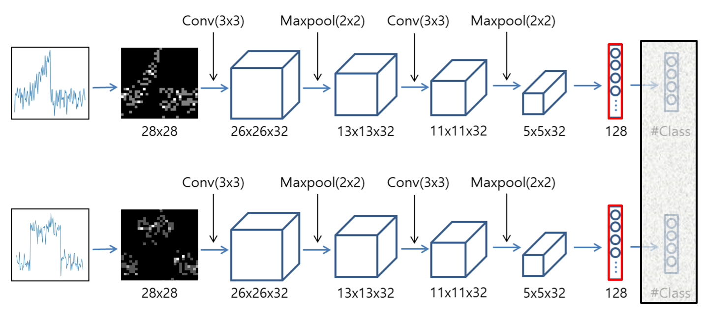
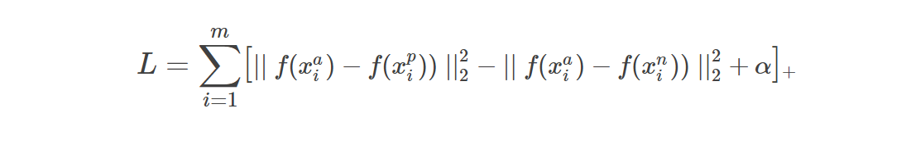

# TimeSeries CNN Classification Using Grid Representation
The purpose of this project is to apply the CNN algorithm(which has achieved great results in image processing) to time series data by representing time series data as images.
We first discuss how to represent time series data as images.
Grid-based representation algorithms are used to represent time-series data as images.
The time series data represented in the image can be used as input values of various CNN based algorithms. 
In order to verify the performance of the CNN based algorithm for the time series image, classification using the CNN model is performed first, and time series embedding using the Siamese network and triplet loss is performed.

Normalization
----------------------
First, We normalize all time series before transform to avoid bias due to differences in data range. Min-Max normalization is applied so that the value of each time series is in the 0-1 range.

>X' = (X-Xmin)/(Xmax-Xmin)

```
def feature_scaling(ts):
    n = len(ts)
    maximum = max(ts)
    minimum = min(ts)

    normalized_ts = list.copy(ts)
    r = maximum-minimum
    for i in range(n):
        normalized_ts[i] = (ts[i]-minimum)/r

    return normalized_ts
```


Representation
----------------------
To represent the time series as image data, we partition the time series using the m x n grid structure.
[Grid representation](https://link.springer.com/article/10.1007/s10115-018-1264-0) is a compression technique that transforms a time series into a matrix format, while maintaining the point distribution of the original time series.

In the following, a detailed algorithm for transforming time-series into the grid is presented with python code.
```
def ts2Matrix(self, ts):
    matrix = np.zeros((self.m, self.n))
    T = len(ts)

    height = 1.0/self.m  # cell's height of grid 
    width = T/self.n  # cell's width of grid

    for idx in range(T):
        i = int((1-ts[idx])/height)
        if i == self.m:
            i -= 1

        t = idx+1
        j = t/width
        if int(j) == round(j, 7):  # If the point is at the cell boundary
            j = int(j)-1
        else:
            j = int(j)

        matrix[i][j] += 1
    return matrix
```

if m=5, n=7

>input: [0.11, 0.22, 0.44, 0.56, 0.78, 0.11, 0.22, 0.00, 0.44, 0.67, 0.22, 0.00, 1.00, 0.44]
>
>output: [[0 0 0 0 0 0 1], [0 0 1 0 1 0 0], [0 2 0 0 1 0 1], [1 0 0 1 0 1 0], [1 0 1 1 0 1 0]]

#### Grid representation example

Grid representation of sample from CBF([UCR archive](https://www.cs.ucr.edu/~eamonn/time_series_data/)) dataset. The partition
matrix is 15 × 30

Convolutional Neural Networks architecture
----------------------
#### Simple Convolutional Neural Networks architecture for grid representation

CNN architecture for time-series classification. This architecture consists of 2 convolution, 2 pooling, and 2 fully-connected layers.
The reason for designing this architecture is to compare with the experimental results of [Hatami et al.](https://arxiv.org/pdf/1710.00886.pdf)(2018) in which the time series are transformed into images using *Recurrent Plot* and the CNN classification is performed.

Time Series Embedding with Siamese Network
----------------------
#### Architecture for time-series embedding

A siamese neural network consists of twin networks which accept distinct inputs. 
However, since the weight of the network is shared, it is actually a structure that uses single network multiple times instead of constructing multiple identical networks at the implementation stage.
In the network for embedding, the relationship between the outputs of three input values is used in the Loss function. This is called triplet loss.

#### Triplet loss
Triplet Loss minimizes the distance between an anchor and a positive and maximizes the distance between the an anchor and a negative.
The anchor is a reference time series, and the positive is another time series belonging to the same class as anchor. On the other hand, the negative means anchors and time series belonging to other classes.

If f(x) is the model output value of the time series data x, the objective of model learning is to minimize the following equation.

[x]+ :  max(x, 0), m: number of triplets


Implementation of triplet loss using keras
```
class TripletLossLayer(layers.Layer):
    def __init__(self, alpha, **kwargs):
        self.alpha = alpha
        super(TripletLossLayer, self).__init__(**kwargs)

    def triplet_loss(self, inputs):
        anchor, positive, negative = inputs
        p_dist = K.sum(K.square(anchor - positive), axis=-1)
        n_dist = K.sum(K.square(anchor - negative), axis=-1)
        return K.sum(K.maximum(p_dist - n_dist + self.alpha, 0), axis=0)

    def call(self, inputs):
        loss = self.triplet_loss(inputs)
        self.add_loss(loss)
        return loss

# Reference: https://nbviewer.jupyter.org/github/krasserm/face-recognition/blob/master/face-recognition.ipynb?flush_cache=true
```

#### Triplet Selection
It is impractical in most cases to use all combinations of training data-sets in the triplet selection. This approach is also undesirable in improving the model. Therefore, it is important to choose triplets that can contribute to model improvement.
As in the [Florian Schroff et al.](https://www.cv-foundation.org/openaccess/content_cvpr_2015/papers/Schroff_FaceNet_A_Unified_2015_CVPR_paper.pdf), Instead of picking the hardest positive, use all anchor-positive pairs in batch, and selecting the hard negative

Experiences 
----------------------
#### Results of grid representation classification for time-series 
| Datasets | (m,n) | GMED | GMDTW |
| :--- | :---: | :---: | :---: |
| 50words | (6, 11) | 0.330 | 0.301 |
| Adiac | (21, 32) | 0.448 | 0.465 |
| Beef | (11, 24) | 0.367 | 0.367 |
| Car | (3, 11) | 0.300 | 0.310 |
| CBF | (3, 11) | 0.003 | 0.003 |
| Coffee | (11, 13) | 0.071 | 0.036 |
| ECG200 | (7, 7) | 0.200 | 0.200 |
| FaceAll | (5, 27) | 0.267 | 0.256 |
| FaceFour | (8, 18) | 0.364 | 0.136 |
| FISH | (11, 19) | 0.269 | 0.251 |
| Gun_Point | (35, 11) | 0.140 | 0.047 |
| Lighting2 | (16, 23) | 0.246 | 0.230 |
| Lighting7 | (5, 6) | 0.370 | 0.384 |
| OliveOil | (29, 6) | 0.300 | 0.267 |
| OSULeaf | (5, 19) | 0.455 | 0.459 |
| Plane | (3, 19) | 0.040 | 0.040 |
| SwedishLeaf | (8, 18) | 0.179 | 0.154 |
| synthetic_control | (6, 13) | 0.063 | 0.057 |
| Trace | (6, 1) | 0.000 | 0.000 |
| Two_Patterns | (16, 23) | 0.020 | 0.036 |
| wafer | (4, 29) | 0.009 | 0.008 |
| yoga | (30, 23) | 0.180 | 0.144 |

In this experiment, we represented time-series data as a grid-based matrix and performed 1-NN classification on test data sets. 
For each data-set, the number of rows and columns in the grid is determined by the LOOCV(leave-one-out cross validation) 1-NN classification using the training data-set.
For more detailed parameters learning procedures, reference [Yangqing Ye et al.](https://link.springer.com/article/10.1007/s10115-018-1264-0) paper.
Note that there is a problem that their experiments are not reproduced accurately. For this reason, we can confirm that the parameters obtained by learning are different from those of Yangqing Ye et al's. For more reliable results, please do your own experiments and check the results.


#### Results of CNN Classification with time-series grid representation
batch size:5, epochs:100

| Datasets | (m:28, n:28)| (m:56, n:56) | (m:64, n:64) | Best((m, n), batch, epochs) |
| :--- | :---: | :---: | :---: | :---: |
| 50words | 0.345 | 0.343 | 0.358 | 0.343 ((28, 28), 5, 50) |
| Adiac | 0.440 | 0.476 | 0.445 | 0.340 ((10, 10), 20, 250) |
| Beef | 0.400 | 0.333 | 0.400 | 0.333 ((56,56), 5, 100) |
| CBF | 0.001 | 0.009 | 0.003 | 0.000 ((14,14), 5, 100) |
| Coffee | 0.036 | 0.036 | 0.036 | 0.000 ((10,10), 5, 250) |
| ECG200 | 0.190 | 0.180 | 0.190 | 0.180 ((56,56), 5, 100) |
| FaceAll | 0.233 | 0.272 | 0.266 | 0.233 ((28,28), 20, 100) |
| FaceFour | 0.261 | 0.182 | 0.182 | 0.170 ((56,56), 20, 150) |
| FISH | 0.137 | 0.103 | 0.120 | 0.103 ((56,56), 20, 100) |
| Gun_Point | 0.027 | 0.047 | 0.040 | 0.027 ((28,28), 5, 100) |
| Lighting2 | 0.246 | 0.246 | 0.197 | ... |
| Lighting7 | 0.411 | 0.466 | 0.479 | ... |
| OliveOil | 0.300 | 0.367 | 0.267 | ... |
| OSULeaf | 0.455 | 0.558 | 0.541 | ... |
| SwedishLeaf | 0.114 | 0.149 | 0.115 | ... |
| synthetic_control | 0.030 | 0.027 | 0.040 | ... |
| Trace | 0.000 | 0.000 | 0.000 | ... |
| Two_Patterns | 0.077 | 0.036 | 0.030 | ... |
| wafer | 0.008 | 0.006 | 0.006 | ... |
| yoga | 0.231 | 0.215 | 0.228 | ... |

Example
----------------------
 * [Grid Representation Classification](Python/Examples/grid_matrix_sample.py) - We reproduced the algorithm and experiment of "Similarity measures for time series data classification using
grid representation and matrix distance(2018)".

 * [Simple CNN Classification For Grid Representation](Python/Examples/grid_matrix_based_cnn_classification.py) - We converted the time series to grid-based matrix and performed classification using the CNN architecture with 2 convolution layers.

 * [Time Series Embedding](Python/Examples/grid_matrix_embedding.py) - (Implementing ...)
 
Credits
----------------------
 Grid matrix representation of time-series borrows algorithms from research paper. Below a complete list of credits can be found.
 
 * Chen Y., Keogh E., et al., [The UCR time series classification archive](https://www.cs.ucr.edu/~eamonn/time_series_data/), 2015
 
 * Yangqing Ye, et al., [Similarity measures for time series data classification using
grid representation and matrix distance](https://link.springer.com/article/10.1007/s10115-018-1264-0), 2018.

 * Nima Hatami, et al., [Classification of Time-Series Images Using Deep Convolutional Neural Networks](https://arxiv.org/pdf/1710.00886.pdf), 2018.

 * Florian Schroff, et al., [FaceNet: A Unified Embedding for Face Recognition and Clustering](https://www.cv-foundation.org/openaccess/content_cvpr_2015/papers/Schroff_FaceNet_A_Unified_2015_CVPR_paper.pdf), 2015.