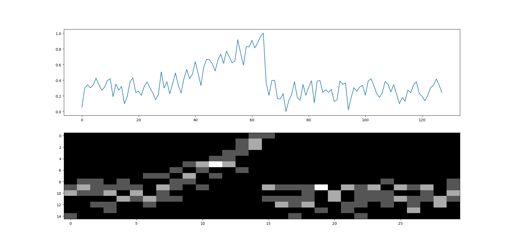
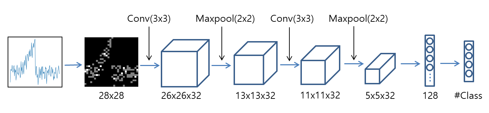

# TimeSeries CNN Classification Using Grid Representation
This project aims to apply the CNN algorithm - which has achieved great results in image processing - by treating the time-series data as an image.
Grid-based representation algorithms are used to represent time-series data as images. 

Normalization
----------------------
First, We normalize all time series before transform to avoid bias due to differences in data range. Min-Max normalization is applied so that the value of each time series is in the 0-1 range.

>X' = (X-Xmin)/(Xmax-Xmin)

```
def feature_scaling(ts):
    n = len(ts)
    maximum = max(ts)
    minimum = min(ts)

    normalized_ts = list.copy(ts)
    r = maximum-minimum
    for i in range(n):
        normalized_ts[i] = (ts[i]-minimum)/r

    return normalized_ts
```


Representation
----------------------
To represent the time series as image data, we partition the time series using the m x n grid structure.
[Grid representation](https://link.springer.com/article/10.1007/s10115-018-1264-0) is a compression technique that transforms a time series into a matrix format, while maintaining the point distribution of the original time series.

In the following, a detailed algorithm for transforming time-series into the grid is presented with python code.
```
def ts2Matrix(self, ts):
    matrix = np.zeros((self.m, self.n))
    T = len(ts)

    height = 1.0/self.m  # cell's height of grid 
    width = T/self.n  # cell's width of grid

    for idx in range(T):
        i = int((1-ts[idx])/height)
        if i == self.m:
            i -= 1

        t = idx+1
        j = t/width
        if int(j) == round(j, 7):  # If the point is at the cell boundary
            j = int(j)-1
        else:
            j = int(j)

        matrix[i][j] += 1
    return matrix
```

if m=5, n=7

>input: [0.11, 0.22, 0.44, 0.56, 0.78, 0.11, 0.22, 0.00, 0.44, 0.67, 0.22, 0.00, 1.00, 0.44]
>
>output: [[0 0 0 0 0 0 1], [0 0 1 0 1 0 0], [0 2 0 0 1 0 1], [1 0 0 1 0 1 0], [1 0 1 1 0 1 0]]

#### Grid representation example

Grid representation of sample from CBF([UCR archive](https://www.cs.ucr.edu/~eamonn/time_series_data/)) dataset. The partition
matrix is 15 × 30

Convolutional Neural Networks architecture
----------------------
#### Simple Convolutional Neural Networks architecture for grid representation

CNN architecture for time-series classification. This architecture consists of 2 convolution, 2 pooling, and 2 fully-connected layers.
The reason for designing this architecture is to compare with the experimental results of [Hatami et al.](https://arxiv.org/pdf/1710.00886.pdf)(2018) in which the time series are transformed into images using *Recurrent Plot* and the CNN classification is performed.

Experiences 
----------------------
#### Results of grid representation classification for time-series 
| Datasets  | (m,n) | GMED | GMDTW |
| :--- | :---: | :---: | :---: |
| 50words | (6, 11) | 0.330 | 0.301 |
| Adiac | (21, 32) | 0.448 | 0.465 |
| Beef | (11, 24) | 0.367 | 0.367 |
| Car | (3, 11) | 0.300 | 0.310 |
| CBF | (3, 11) | 0.003 | 0.003 |
| Coffee | (11, 13) | 0.071 | 0.036 |
| ECG200 | (7, 7) | 0.200 | 0.200 |
| FaceAll | (5, 27) | 0.267 | 0.256 |
| FaceFour | (8, 18) | 0.364 | 0.136 |
| FISH | (11, 19) | 0.269 | 0.251 |
| Gun_Point | (35, 11) | 0.140 | 0.047 |
| Lighting2 | (16, 23) | 0.246 | 0.230 |
| Lighting7 | (5, 6) | 0.370 | 0.384 |
| OliveOil | (29, 6) | 0.300 | 0.267 |
| OSULeaf | (5, 19) | 0.455 | 0.459 |
| Plane | (3, 19) | 0.040 | 0.040 |
| SwedishLeaf | (8, 18) | 0.179 | 0.154 |
| synthetic_control | (6, 13) | 0.063 | 0.057 |
| Trace | (6, 1) | 0.000 | 0.000 |
| Two_Patterns | (16, 23) | 0.020 | 0.036 |
| wafer | (4, 29) | 0.009 | 0.008 |
| yoga | (30, 23) | 0.180 | 0.144 |

#### Results of CNN Classification with time-series grid representation
| Datasets  | (m, n) | error rate |
| :--- | :---: | :---: |
| CBF | (28, 28) | 0.001 |
| ... | ... | ... |

Example
----------------------
 * [Grid Representation Classification](Python/Examples/grid_matrix_sample.py) - We reproduced the algorithm and experiment of "Similarity measures for time series data classification using
grid representation and matrix distance(2018)".

 * [Simple CNN Classification For Grid Representation](Python/Examples/grid_matrix_based_cnn_classification.py) - We converted the time series to grid-based matrix and performed classification using the CNN architecture with 2 convolution layers.

Credits
----------------------
 Grid matrix representation of time-series borrows algorithms from research paper. Below a complete list of credits can be found.
 
 * Chen Y., Keogh E., et al., [The UCR time series classification archive](https://www.cs.ucr.edu/~eamonn/time_series_data/), 2015
 
 * Yangqing Ye, et al., [Similarity measures for time series data classification using
grid representation and matrix distance](https://link.springer.com/article/10.1007/s10115-018-1264-0), 2018.

 * Nima Hatami, et al., [Classification of Time-Series Images Using Deep Convolutional Neural Networks](https://arxiv.org/pdf/1710.00886.pdf), 2018.